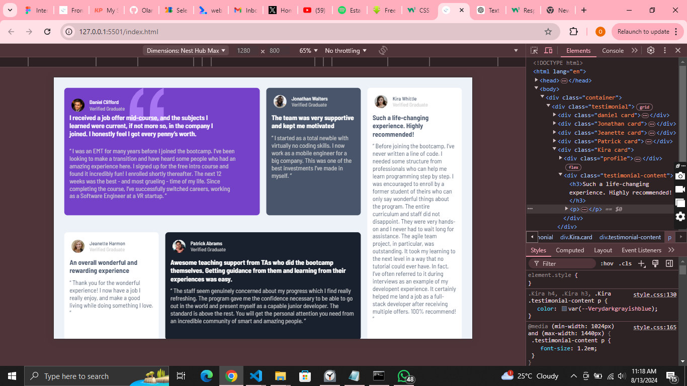

# Frontend Mentor - Testimonials grid section solution

This is a solution to the [Testimonials grid section challenge on Frontend Mentor](https://www.frontendmentor.io/challenges/testimonials-grid-section-Nnw6J7Un7). Frontend Mentor challenges help you improve your coding skills by building realistic projects.

## Table of contents

- [Overview](#overview)
  - [The challenge](#the-challenge)
  - [Screenshot](#screenshot)
  - [Links](#links)
- [My process](#my-process)
  - [Built with](#built-with)
  - [What I learned](#what-i-learned)
  - [Continued development](#continued-development)
  - [Useful resources](#useful-resources)
- [Author](#author)
- [Acknowledgments](#acknowledgments)

## Overview

### The challenge

Users should be able to:

- View the optimal layout for the site depending on their device's screen size

### Screenshot



### Links

- Solution URL: [Add solution URL here](https://github.com/OlamideLanre/Testimonials-grid-section)
- Live Site URL: [Add live site URL here](https://your-live-site-url.com)

## My process

### Built with

- Semantic HTML5 markup
- CSS custom properties
- Flexbox
- CSS Grid

### What I learned

This project helped dive deeper into css grid, I learned how to span colums and rows, how to shift contents from one column/row to another.

```html
<h1>Some HTML code I'm proud of</h1>
```

```css
somecssiamproud of: .daniel {
  grid-column: span 2;
}
.daniel h3 {
  width: 80%;
  top: -50px;
}
.testimonial-content .danielP {
  width: 90%;
  margin-top: 38px;
}
.Patrick {
  grid-column: 2 / span 2;
}
.Jeanette {
  grid-row: 2;
}
.Kira {
  grid-row: 1 / span 2;
  grid-column: 4;
}
```

### Continued development

I want to look more into css positions cause I struggled alot with the quote image, also I will contine my study of grid and flex but most impoertantly css positions.

### Useful resources

- [ resource 1](https://www.w3schools.com/cssref/pr_grid-row.php) - This helped me for understand css grid row. Although I used the shorthand, I really liked this pattern and will use it going forward.
- [ resource 2](https://youtu.be/rg7Fvvl3taU?si=y_ACkNVLkwovK_yb) - This is an amazing tutorial which helped me finally understand css grid. I'd recommend along with [ resource 1] it to anyone still learning this concept.

## Author

- Frontend Mentor - [@OlamideLanre](https://www.frontendmentor.io/profile/OlamideLanre)
- Twitter - [@bukumiiip\_](https://www.twitter.com/bukumiiip_)

## Acknowledgments

I'd like to thank youtuber kelvin powell for him amazing teaching.
